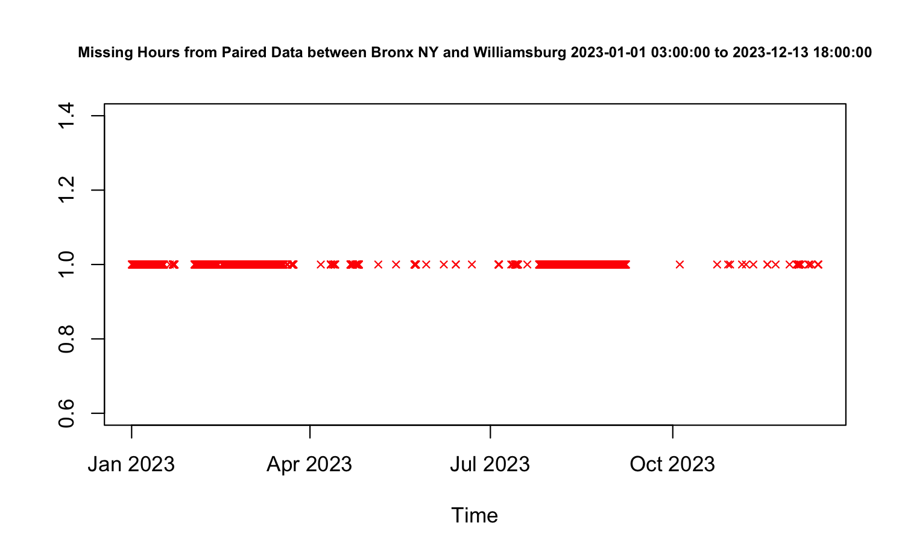
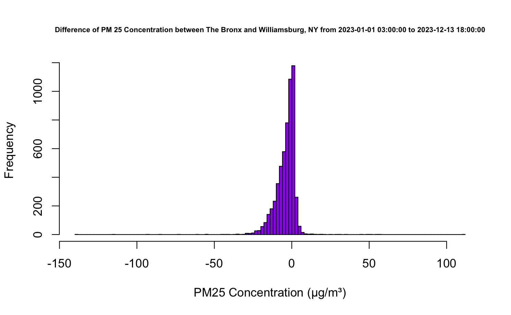
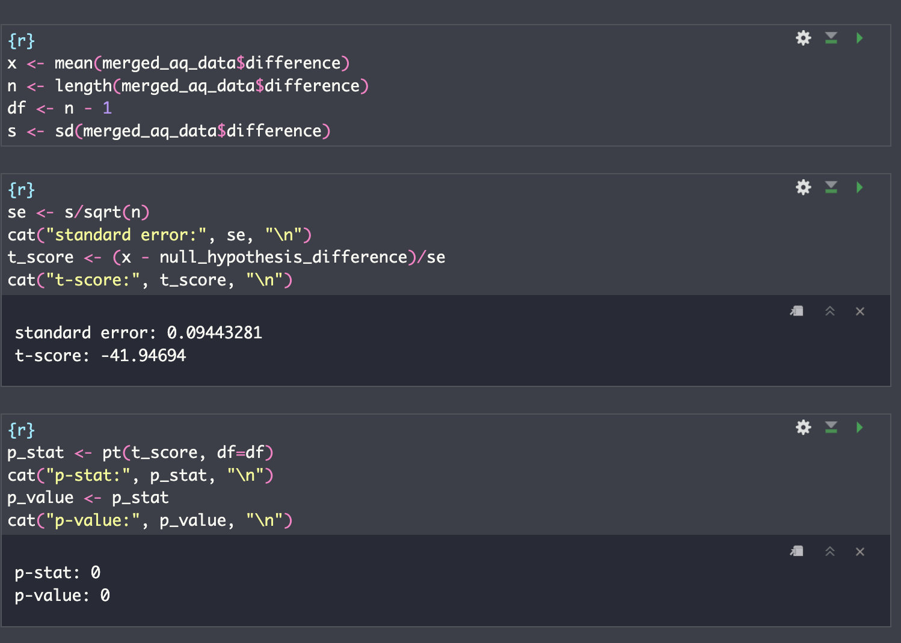
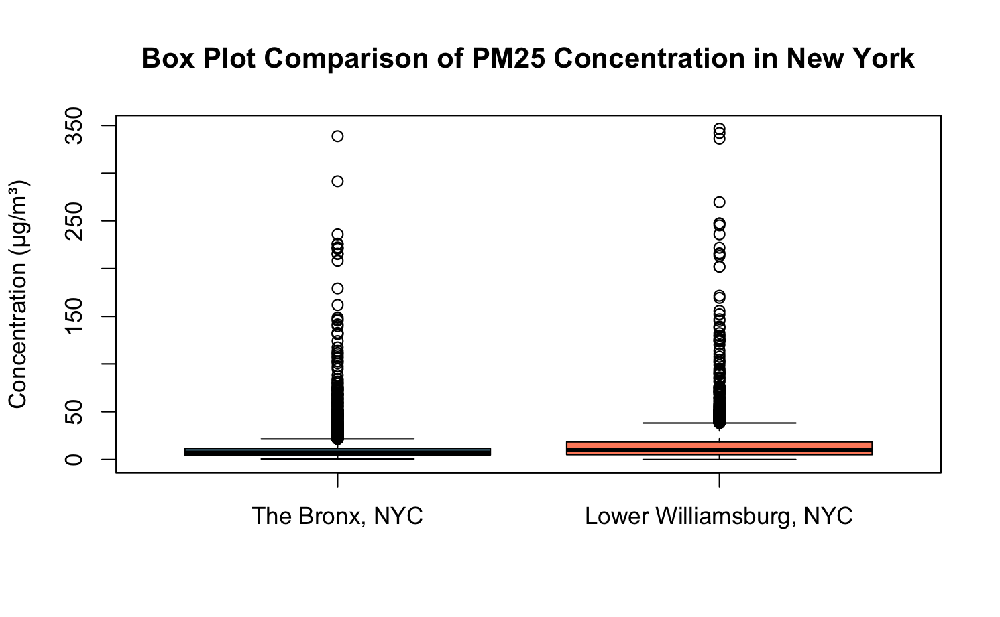

## Data Transparency

AirNow. (n.d.). Fair Bronx - IS74. Retrieved 13 Dec. 2023, from [https://api.openaq.org/v2/measurements?location_id=665&parameter=pm25&date_from=2020-12-11T19:00:00-05:00&date_to=2023-12-13T13:43:09-05:00&limit=30000'](https://api.openaq.org/v2/measurements?location_id=665&parameter=pm25&date_from=2020-12-11T19:00:00-05:00&date_to=2023-12-13T13:43:09-05:00&limit=30000')

AirNow. (n.d.). Driggs 285. Retrieved 13 Dec. 2023, from

[https://api.openaq.org/v2/measurements?location_id=346723&parameter=pm25&date_from=2020-12-11T19:00:00-05:00&date_to=2023-12-13T13:53:27-05:00&limit=30000'](https://api.openaq.org/v2/measurements?location_id=346723&parameter=pm25&date_from=2020-12-11T19:00:00-05:00&date_to=2023-12-13T13:53:27-05:00&limit=30000')

All the data used for testing was captured between the dates of January 1st, 2023 and December 13th, 2023.

## Affluent Community Labeled "Disadvantaged" by Air Pollution Measurements

New York's Climate Justice Working Group claims that air pollution levels in Williamsburg, an affluent New York City neighborhood, classify the area as a ["disadvantaged community"](https://arc.net/l/quote/tdfsjypx). However, because of the Canadian wildfires causing discrepancies within data and dicomity between wealth and the term 'disadvantaged', we are highly skeptical that air pollution levels exceed that of actual disadvantaged communities like in Hunterspoint, NY, where 50% of the population falls under the poverty line.

Therefore, we are going to try and test New York's Climate Justice Working Group alternative hypothesis and prove with an alpha level of .05, the claim Williamsburg, NY has a higher concentration of particulate matter (PM25), a known pollutant, than the Bronx.

## Hypothesis

The population is hourly pm(2.5) concentration (µg/m³) in New York during 2023 for both stations.

We can't just use our data because it would not represent the entire day of 2023. We are missing hours and therefore don't have the exact answer. Hypothesis test gives us the best results we can get.

We are doing a t-paired test because Bronx air quality affects both Williamsburg and Bronx and vice versa. This means they are locationally dependent on each other. Another reason is that outside sources such as wildfire as you will see in our data can cover both the city and such bad air quality that in a couple cases broke the stations quality gauge.



Therefore,

-   **Null Hypothesis**

    -   H0 : ᘈ(A-B) =\> 0 That the difference between Bronx and Williamsburg Hourly PM25 concentration are not different or Bronx has clearer air.

-   **Alternative Hypothesis**

    -   Ha: ᘈ(A-B) \< 0 Our claim is that Williamsburg has a higher Hourly PM25 concentration air compared to Bronx.

We chose our alpha level to be .01 based off of the fact that we have many datapoints meaning we can be more accurate with our data and hold it to a higher degree of scrutiny.

```{r}
null_hypothesis_difference <- 0
alpha_level <- 0.01
```

## **T-Paired Test**

### Assumption

**Dependence of Each Dateset** ✅\
We are doing a t-paired test because Bronx air quality affects both Williamsburg and Bronx and vice versa. This means they are dependent based off of their location. Another reason is that outside sources such as wildfire as you will see in our data can cover both the city and such bad air quality that in a couple cases broke the stations quality gauge.

**Normal Distribution** ✅



Data shape is approximately normal. In addition our data has over 40 points.

**Independence** ✅

Each data point is recorded on separate hours independent of each other. While, global warming adds slightly increases the concentration over time, it is the same for each data point.

**Random Sampling** ⚠️

Most of our data is missing during the time period of September and February. During this tim period there were multiple wildfires. This makes the sample not random and instead depending on the reason they were missing. Unfortunately it is hard to tell the exact reason as the wildfires quality air got so bad that sensors stopped working as well. This means it is hard to tell what was raining and what was because of those fires.


## Calculations



## Conclusion

In conclusion, Because our p-value is close to 0 (R approximated our p-value) \< .alpha level = .05, we reject the null hypothesis that the mean difference of hourly PM25 concentration difference between Williamsburg NY and The Bronx NY is equal to 0.

Therefore, New York's New York's Climate Justice Working Group is confident that wealthier areas of New York have worse air pollution then that of less income areas or at least this is the case for Williamsburg and the Bronx.

## Limitations

Possible errors include rain. This one may not have much effect. As the Bronx is so close to Williamsburg  that there is no way the rain is much different between the two. It is also possible that one of the stations has a worse sensor in which case that one would be off due to rain more often but it is hard to tell if that is the case and which one especially.

Another minor error is that Williamsburg is slightly more north compared to the Bronx. This is important as many wildfires start in Canada. Meaning there is a chance that some of the data is going to be skewed low.

As we mentioned before, some of the data is missing from specific time periods. This makes it hard to also factor in those times as well.

In addition there are a lot of data points that fall way outside the bounds. You can see that in the box plot. This is because of the wild fires.



## Concluding Remarks

While the data may have been contrary to what we believe, the implications of this do not necessarily place these communities in the same criteria of climate harm as communities such as The Bronx /Hunterspoint. Thomas Frank's article highlights this fact by understanding that it may be time to change how we classify "disadvantaged communities".
